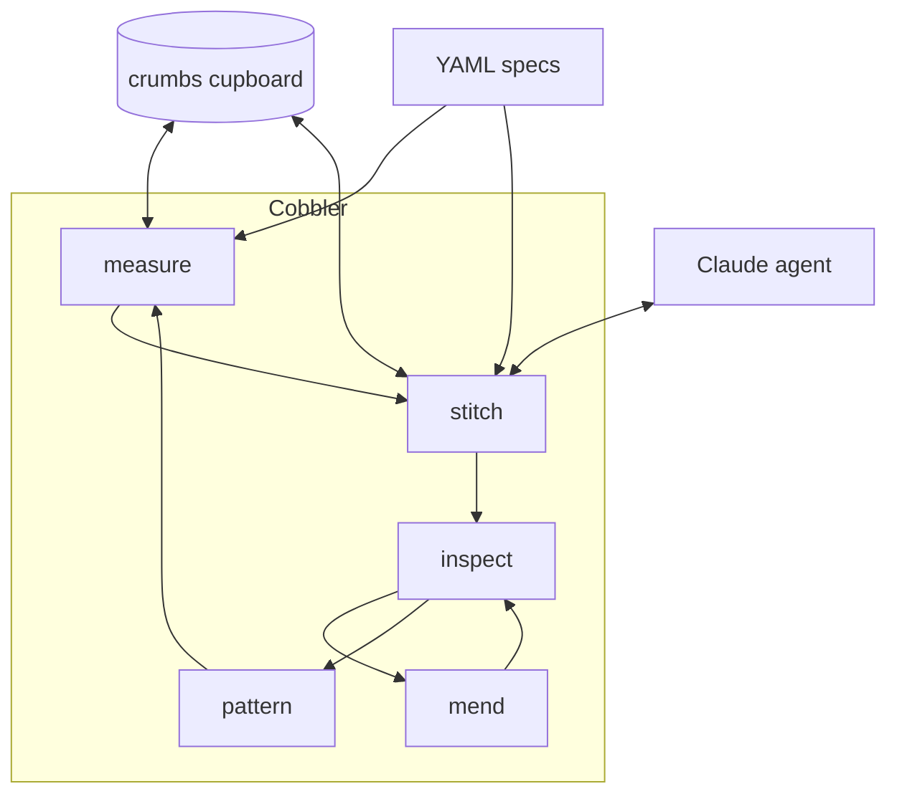

# cobbler

Iterative context management for AI coding agents.

## Architectural Thesis

Coding agents produce useful output when given the right context. The problem is assembling that context: what files matter, what requirements apply, what the agent already knows. Cobbler solves this by breaking work into small tasks, assembling minimal context for each one from structured specifications, dispatching the task to an agent one-shot, evaluating the result, and deciding what happens next. Five commands — measure, stitch, inspect, mend, pattern — compose into an iterative loop that manages the inductive development path.

## System Diagram



## Project Scope and Status

Cobbler is in phase 01.0: stitch for documentation. The roadmap defines four releases across 12 use cases, validated by 4 test suites against 5 product requirements.

| Release | Focus | Use Cases | Status |
|---------|-------|-----------|--------|
| 01.0 | Core stitch (docs) | 4 | Current |
| 02.0 | Core stitch (code) | 2 | Planned |
| 03.0 | Measure | 3 | Planned |
| 04.0 | Inspect, mend, pattern | 3 | Planned |

## Methodology

Cobbler follows specification-driven development. Specifications are the source of truth; code serves specifications. The chain runs: VISION (goals) to ARCHITECTURE (components) to PRDs (numbered requirements) to use cases (tracer bullets) to test suites (validation) to code. All specification documents use YAML with typed schemas enforced by `mage analyze`, which runs 6 cross-artifact consistency checks covering orphaned PRDs, missing test suites, broken touchpoints, roadmap coverage, and strict schema validation.

## Repository Structure

```
cobbler/
├── cmd/cobbler/           CLI entry point (cobra)
├── internal/crumbs/       Cupboard wrapper (crumbs Go module)
├── docs/
│   ├── VISION.yaml        Project goals and boundaries
│   ├── ARCHITECTURE.yaml  Component design and interfaces
│   ├── SPECIFICATIONS.yaml Cross-reference index
│   ├── road-map.yaml      Release schedule and use case status
│   ├── specs/
│   │   ├── product-requirements/  PRDs (prd001–prd005)
│   │   ├── use-cases/            12 use cases across 4 releases
│   │   └── test-suites/          Per-release test specifications
│   ├── constitutions/     Writing and coding standards
│   └── prompts/           Measure and stitch prompt templates
├── magefiles/             Build and analysis targets (cobbler-scaffold)
├── benchmarks/            Fixture directories for stitch validation
├── scripts/               Prototype scripts (being replaced)
└── configuration.yaml     Orchestrator configuration
```

## Technology Choices

- **Go** because cobbler imports crumbs as a module and needs type safety across the cupboard interface, agent interface, and prompt construction.
- **Crumbs** (`github.com/petar-djukic/crumbs`) because all work lives in the cupboard — cobbler reads, writes, and creates crumbs rather than maintaining its own store.
- **Cobra** for CLI because cobbler's five commands (measure, stitch, inspect, mend, pattern) map to subcommands with shared configuration.
- **cobbler-scaffold** for build tooling because `mage analyze` enforces specification consistency across PRDs, use cases, test suites, and roadmap with typed YAML schema validation.

## Build and Test

Requires Go 1.25+ and [mage](https://magefile.org/).

```bash
mage build          # Compile the cobbler binary
mage lint           # Run golangci-lint
mage analyze        # Run 6 cross-artifact consistency checks
mage stats:loc      # Print Go LOC and documentation word counts
```

See [VISION.yaml](docs/VISION.yaml) for project goals, [ARCHITECTURE.yaml](docs/ARCHITECTURE.yaml) for component design, and [SPECIFICATIONS.yaml](docs/SPECIFICATIONS.yaml) for the full traceability index.
